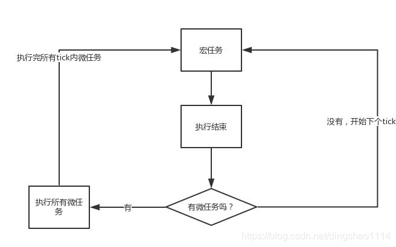
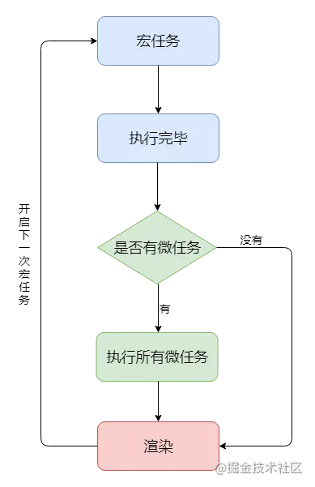

# Event Loop(事件循环)

## 为什么会有事件循环
1. js单线程的特性。如果所有的代码都是同步的，那么关于网络请求等一系列需要耗时的操作就会导致线程进入等待的状态。会造成页面卡顿，用户交互无响应的情况。
2. 为了解决上述的问题，js的宿主环境（浏览器，Node）通过某种方式（主线程、任务队列、事件循环），使得JS具备了异步的特性。

## 浏览器事件循环
### 事件循环的定义
1. 不同的任务进入不同的地方，同步任务进入主线程，异步任务进入Event Table并注册函数
2. 当指定的事件完成时（比如: setTimeout延时到达的时候），Event Table会将这个函数移入Event Queue（任务队列）
3. 当主线程的任务全部执行完毕为空时，回去Event Queue读取对应的函数，进入主线程执行
4. 上述的过程不断的重复，也就是事件循环

### 宏任务和微任务
微任务：主要包括Promise、MutaionObserver、process.nextTick(Node.js 环境)
宏任务：主要包括script( 整体代码)、setTimeout、setInterval、I/O、UI 交互事件、setImmediate(Node.js 环境)。可以理解为除了微任务之外的任务

### 宏任务和微任务决定代码在事件循环中的执行顺序。
微任务的执行是当前事件循环的最后一步，需要清空所有的微任务才能进行下次的事件循环（在有微任务的情况下，优先执行微任务）


### 事件循环和页面渲染的关系
根据HTML标准，一轮事件循环执行结束之后，下轮事件循环执行之前开始进行 UI render。即：宏任务执行完毕，接着执行完所有的微任务后，此时本轮循环结束，开始执行UI render。UI render完毕之后接着下一轮循环。


## nodejs事件循环
### 生命周期
```javascript
   ┌───────────────────────────┐
┌─>│           timers          │
│  └─────────────┬─────────────┘
│  ┌─────────────┴─────────────┐
│  │     pending callbacks     │
│  └─────────────┬─────────────┘
│  ┌─────────────┴─────────────┐
│  │       idle, prepare       │
│  └─────────────┬─────────────┘      ┌───────────────┐
│  ┌─────────────┴─────────────┐      │   incoming:   │
│  │           poll            │<─────┤  connections, │
│  └─────────────┬─────────────┘      │   data, etc.  │
│  ┌─────────────┴─────────────┐      └───────────────┘
│  │           check           │
│  └─────────────┬─────────────┘
│  ┌─────────────┴─────────────┐
└──┤      close callbacks      │
   └───────────────────────────┘
```
1. 定时器（Timer）阶段
执行内容：定时器（setTimeout, setInterval）的回调
执行策略：进入定时器阶段会计算当前时间和setTimeout(callback, delay), setInterval(callback, delay)注册时的差值，对比这个差值确定当前定时器阶段需要执行的定时器回调。定时器回调是以升序存储在内存中。差值大于delay的回调被执行。当检测到差值小于delay会停止检测进入下一个阶段。当还存在差值大于delay的回调但是到达系统依赖的最大限制也会进入下一个阶段。剩下的回调在下个循环中执行。
__定时器会有很多的检测操作，判断定时器阶段该执行那些定时器回调。比较消耗资源__

2. Pending 回调阶段
执行内容：处理系统操作的回调函数（ 例如TCP 套接字在尝试连接时接收到 ECONNREFUSED，这些错误的回调将被放到此阶段的回调函数）
执行策略：逐一执行padding队列中的回调，直到队列为空或者到达系统依赖的最大限制进入下一阶段

3. Idle, Prepare 阶段
执行内容：node处理内部操作的阶段
执行策略：无需关注

4. 轮询（Poll）阶段
执行内容： 处理如IO操作，网络请求等异步回调
执行策略：
* 1.当此阶段的回调函数不为空时，执行队列中的回调。当队列为空或到达系统依赖的最大限制进入下一阶段
* 2.当此阶段的回调函数为空时，系统会等待新的回调，如果一直没有新的回调入队的话，会检查timers阶段有没有回调超时。如果有进入下一个阶段

5. check 阶段
执行内容： 处理setImmediate的回调函数
执行策略：执行回调至队列为空或者到达系统依赖的最大限制进入下一阶段

6. Close callback 阶段
执行内容： 处理关闭或者销毁类型的回调
执行策略：执行完相关回调之后，判断下个循环有没有内容要执行。如果有进入下一个事件循环。若果没有则退出

7. nextTickQueue
执行内容： process.nextTick() 的回调
执行策略：每个阶段都会执行，会在当前阶段进入下个阶段之前尽快执行。执行回调至队列为空，没有系统最大限制

8. microTaskQueue
执行内容： Promise 的回调
执行策略：每个阶段都会执行，会在当前阶段进入下个阶段之前尽快执行。执行回调至队列为空，没有系统最大限制
__nextTickQueue的优先级高于microTaskQueue。因为都没有系统最大限制，所以要注意不要一直注册他们都回调。会造成阻塞__

### nodejs代码顺序分析
```javascript
let carName;
function myCar() {
    process.nextTick(()=>{
        console.log("process.nextTick:this is mycar: " + carName);
    });
    setTimeout(() => {
        console.log("setTimeout:this is mycar: " + carName);
    });
    Promise.resolve().then(()=>{
        console.log("Promise.resolve().then:this is mycar: " + carName);
    });
    setTimeout(() => {
        console.log("setTimeout:this is mycar2: " + carName);
    });
    setImmediate(()=>{
        console.log("setImmediate:this is mycar: " + carName);
    });
}
function setCarName() {
    carName = "Audi";
}
myCar();
setCarName();
// process.nextTick:this is mycar: Audi
// Promise.resolve().then:this is mycar: Audi
// setTimeout:this is mycar: Audi
// setTimeout:this is mycar2: Audi
// setImmediate:this is mycar: Audi

setTimeout(() => {
    setCarName();
})
myCar();
// process.nextTick:this is mycar: undefined
// Promise.resolve().then:this is mycar: undefined
// setTimeout:this is mycar: Audi
// setTimeout:this is mycar2: Audi
// setImmediate:this is mycar: Audi

myCar();
setTimeout(() => {
    setCarName();
})
// process.nextTick:this is mycar: undefined
// Promise.resolve().then:this is mycar: undefined
// setTimeout:this is mycar: undefined
// setTimeout:this is mycar2: undefined
// setImmediate:this is mycar: Audi
```
1.同步代码优先级高于异步代码，否则打印的carName应该为undefined
2.异步代码如果分属不同的阶段，那么执行顺序也是固定。相同阶段相同时间参数顺序执行。
3.process.nextTick、Promise.resolve().then优先级高于其他阶段的任务（在每个阶段开始之前运行）
4.process.nextTick的优先级高于Promise.resolve().then